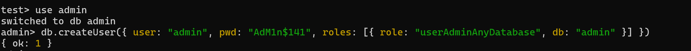
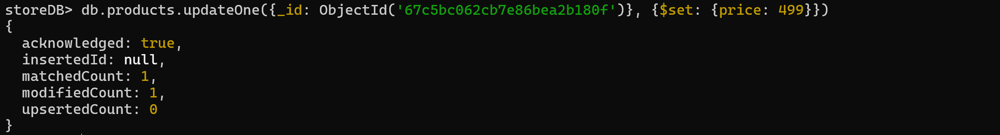

# Users in MongoDB
In MongoDB, users can be created to have different roles or capabilities.   
This can be pretty useful if you want to share a database, but you dont want people to alter the data in it.

The creation of user is essential for the indetification and authorization inside MongoDB, so they have to be created before using authorization in the database.

The steps to create different users are made in the MongoDB Shell, by using the command ***mongosh*** in the command prompt or powershell. 


## Create Users
### Admin User

Move to the admin database:
```bash
use admin
```

To create an admin user:

```bash
 db.createUser({ 
    user: "admin", 
    pwd: "AdM1n$141", 
    roles: [{ role: "userAdminAnyDatabase", db: "admin" }] 
    })
```



This creates an admin user, in the admin database, that has the role to alter all databases, to the current ones to the ones to be created in the future.   
Its recommended to give a strong password to the admin user.

You can add more roles using the **updateUser()** command:
```bash
db.updateUser("admin",
{
    roles: [
        {role: "readWriteAnyDatabase", db: "admin"},
        {role: "dbAdminAnyDatabase", db: "admin"}]});
```


This gives the read-write role and the whole databse control of in any database. 

Feel free to change the name and password of your admin user.


### Read Only User

Move to the database where you want to create the user:
```bash
use SocialApp
```

To create an read user:

```bash
 db.createUser({ 
    user: "readUser", 
    pwd: "readiread", 
    roles: [{ role: "read", db: "SocialApp" }] 
    })
```


This creates a user that can only read data, therefor it cannot alter any database content of the "SocialApp".

If you specify it only to be a "read" user it will only have access to the database where it was created, but if you use "readAnyDatabase" it can read all the existing databases.


### Read Write User

Move to the database where you want to create the user:
```bash
use ClotheShop
```

To create an read write user:

```bash
db.createUser({ 
    user: "rwUser", 
    pwd: "read&$write", 
    roles: [{ role: "readWrite", db: "ClotheShop" }] 
    })
```


This create a user that can read data and alter data, like add, update and delete the content of the "ClotheShop" database.

Like the read user, if you specify it only to be a "readWrite" user it will only have access to the database where it was created, but if you use "readWriteAnyDatabase" it can read and write in all the existing databases.


## User Test
To enable the authentication feature of MongoDB, please check the [Enable Authentication File](EnableAuthentication.md).

With the authentification enabled in MongoDB, the created users now have importance. By using them we can access all the databases (only if the user is an admin).

To use any user, go to the database where is located and use:
```bash
db.auth("name","password")
```

You can also use this to access MongoDB with as a user:
```bash
mongosh -u "userName" -p "userPassword" --authenticationDatabase "database name"
```

Change the field for their respective user fields.


### Admin User Test
To use the admin user, go to the admin database and user the command shown previously.


You can view every database, and because you are an admin, you can also alter any data from any database.


It can also make the CRUD (Create, Read, Update, Delete) operations in any database.





And it can create indexes too.


### Read Only User Test
To use the read only user, go to the database where is located use the command shown previously.


The SocialApp database is only shown because this user only has access to read that database.

The user can only read data, therefor can use methods like **find()**.

If the user wants to alter (Create, Update or Delete), an error will be shown, because he doesnt have that role.


### Read Write User Test
To use the read-write user, go to the database where is located use the command shown previously.
This user can see the collections and read the data inside them. In this case, the *Categories* collection data.


It can also alter the data, in this case a new document was created, but the other documents can be updated or deleted too.   
It can use methods like: **insertOne()**, **updateOne()**, **deleteOne()**, and so on...


It can create indexes too.


Although this user can make changes, it cannot create another user for the database, being this an admin user task or its just not his role. By this we can see that this user cant make the actions of an admin. 


***

Return to the [README file](README.md).