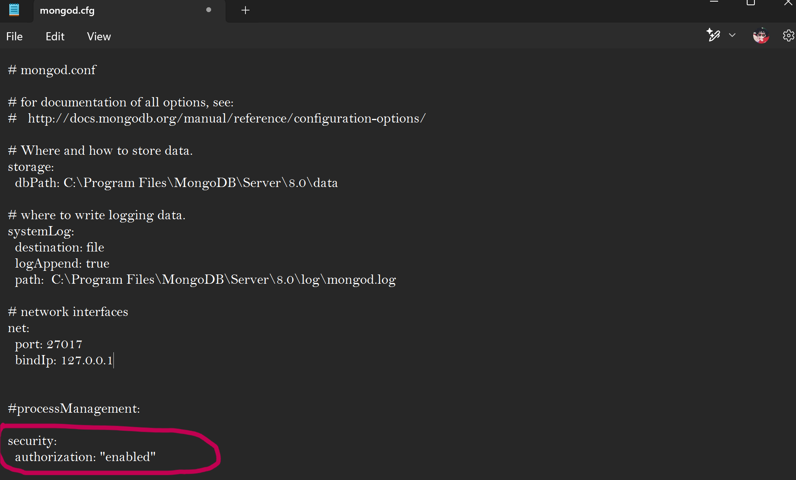
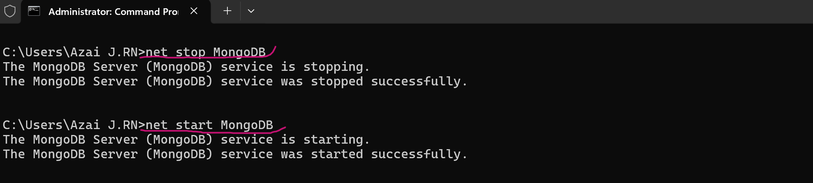
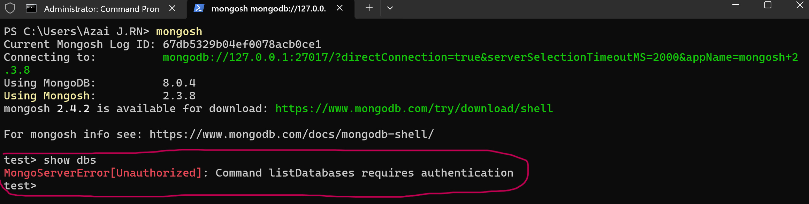

# Enable User Authentication in MongoDB
Security on a database is a standard nowdays, although MongoDB doesnt have the authentication feature enable by default, it posible to make it work.   

Here you will find steps to enable the user authetication in MongoDB.

Please remember that you have to create the users before enabling the authentication.


## Open the mongod.cfg file
Commonly, this file is located in C:\Program Files\MongoDB\Server\Version\bin.   
You can open this file using powershell, notepad, notepad++, etc...   
In this case, notepad was used.   

Remember to use this programs as an administrator, to apply changes more easily.  


## Enable security in the file
Inside the file go to the security section and add:   

```bash
security:
  authorization: enabled
```



Remember to save the changes.


## Restart MongoDB
To set the changes to MongoDB you need to restart the service. This can be made in the command prompt and powershell as an administrator. 

To stop MongoDB type:
```bash
net stop MongoDB
```

To start MongoDB type:
```bash
net start MongoDB
```

If done correctly, messages of confirmation will be shown.



If an error occures its most probably that is a sintax error inside the mongo.cfg file.


## Check in Mongo shell
You can go use the command prompt or the powershell to enter mongodb using the ***mongosh*** command.

If you enter normally, and you want to use the database, it will notify that you need authentication. You can use enter databases, but not alter them.



***

To know how to authentificate using a user, check the [Create Users File](CreateUsers.md).

Return to the [README file](README.md).
