# MongoDB Compass Authentication
To know how to create users in MongoDB using the mongo shell check the [Create Users File](CreateUsers.md).

To enable authentication in MongoDB check the [Authentication File](EnableAuthentication.md).

The users created will be used to authenticate in MongoDB Compass, a GUI for the easy use the databases.

Its needed to have MongoDB Compass installed and ready to use.

To connect to the test (default) database click in the **Connect** button or in the 3 dots on the side, in the option **Edit connection**.


## Without Authetification
If the authentification is disabled in MongoDB, by using the connection ***mongodb://localhost:27017/*** is more than enough to access.

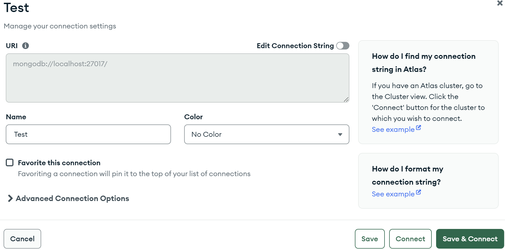

If the authentication is enabled, the connection string will not work, it will show the following message:

```notepad
Failed to retrieve server info
MongoServerError: Command hostInfo requires authentication
```

This mean we'll have to use authentification, therefor, a user.


## Connect using a user
To connect to MongoDB Compass using any user, press the 3 dots on the left of the **test** database and click in the ***Edit connection*** section.

There, select the **Advance connection options** below. Inside, go to the **Authentication** section, there you can enter the necessary data from the user that i will be used. Then press **Connect** or **Save & Connect**.

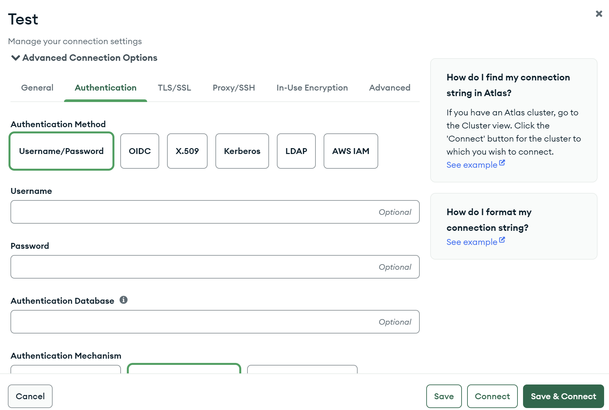

Check the [Create Users file](CreateUsers.md) to know how to set up a user or to see their names and passwords.


## Admin User
To use the admin user, the necessary fields where filled.

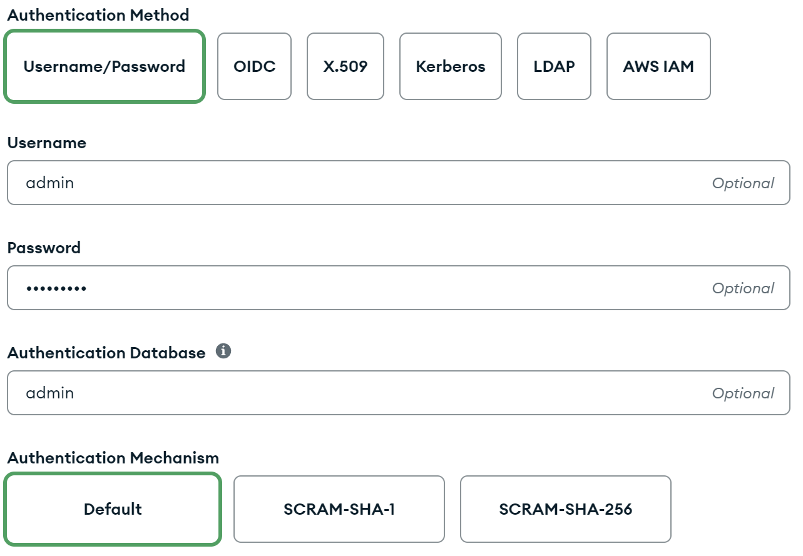

If the fields are correct, it will show all the databases.

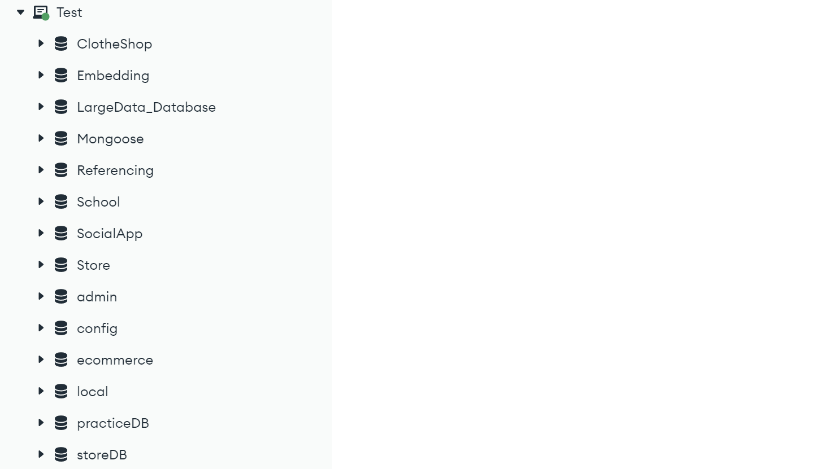

This admin user can use the CRUD operation in any database. To know roles and available operations of an admin user check the [Create Users file](CreateUsers.md) in the ***Test*** section.


## Read User
To use the read user, the necessary fields where filled.

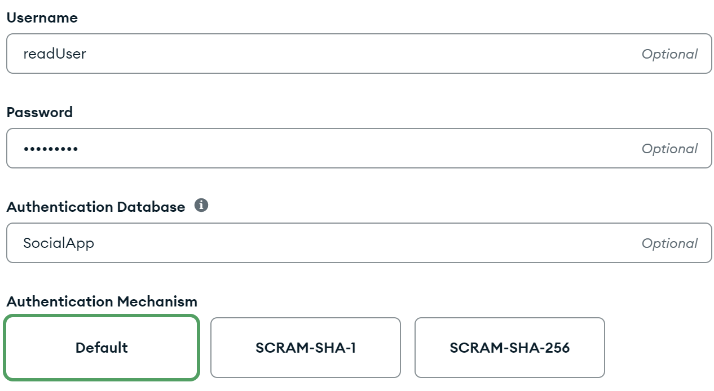

If the fields are correct, it will show the database where this user is located or has access.

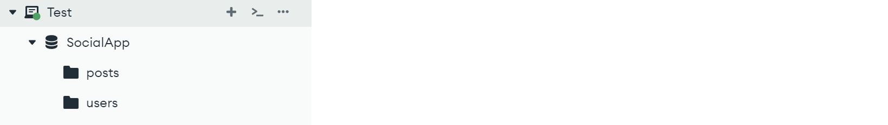

The read user can't alter the data inside the database.

It cannot insert or create any document.

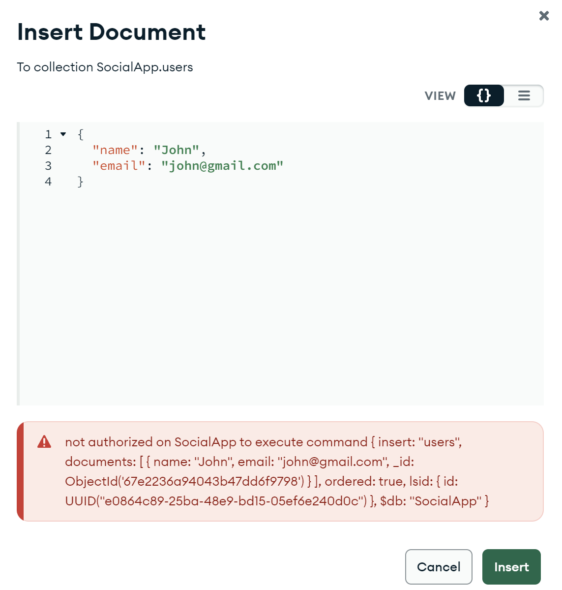

It can read documents and make queries.

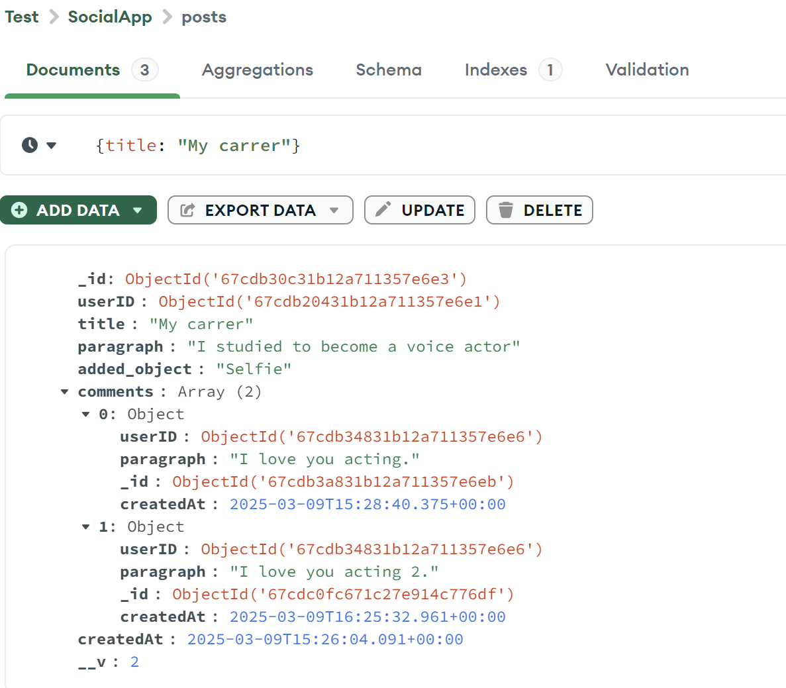

It cannot update any document.

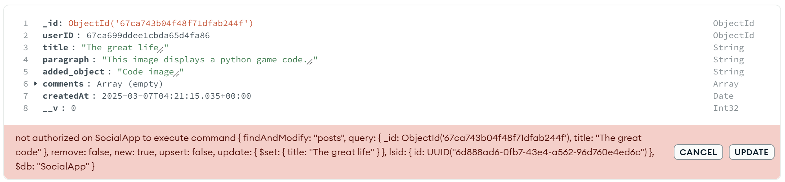

It cannot delete any document.

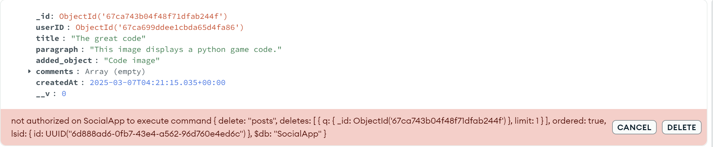

As shown the read user can only read documents, as simple as that.


## Read-Write User
To use the read-write user, the necessary fields where filled.

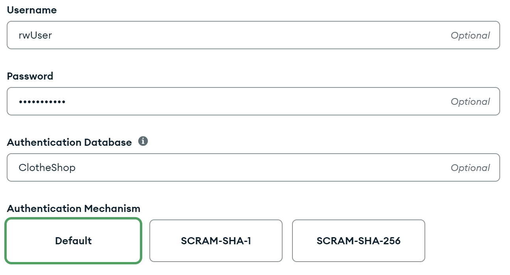

If the fields are correct, it will show the database where this user is located or has access.

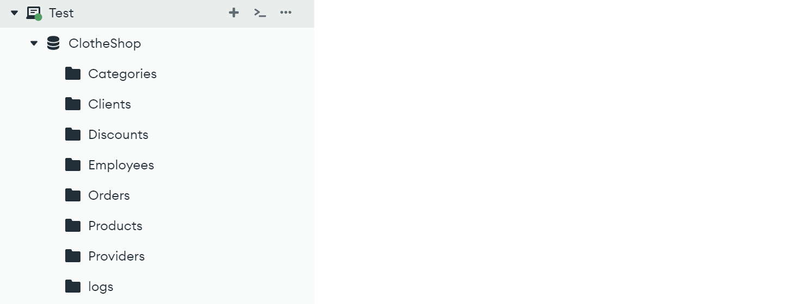

The read-write user can use the CRUD operations in the database.

It can insert or create documents.

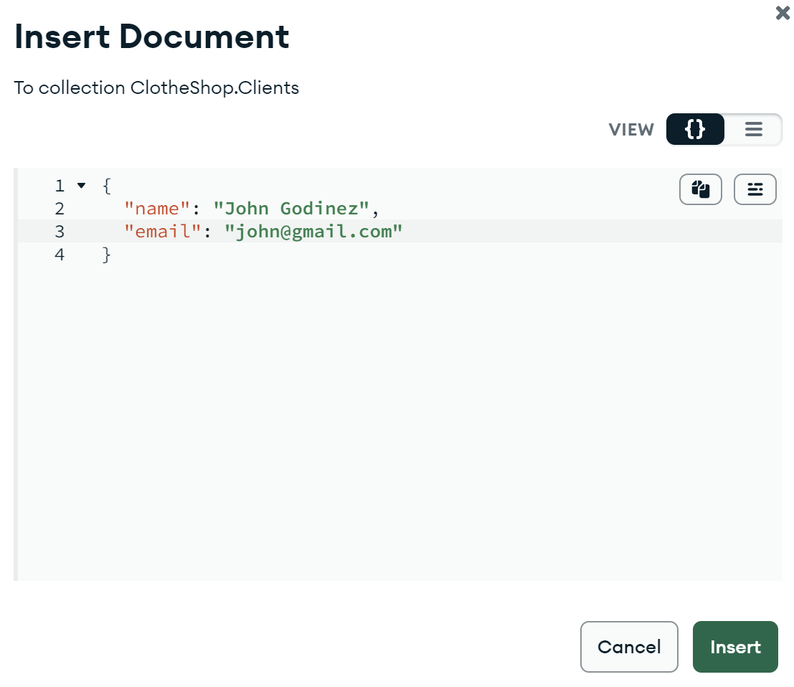
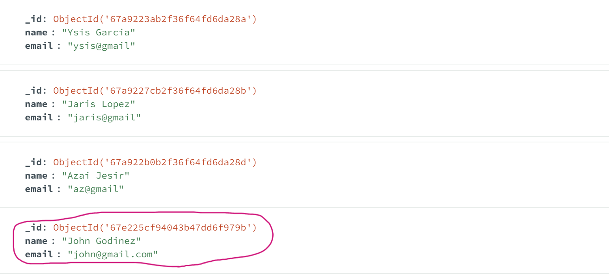

It can read data and make queries.

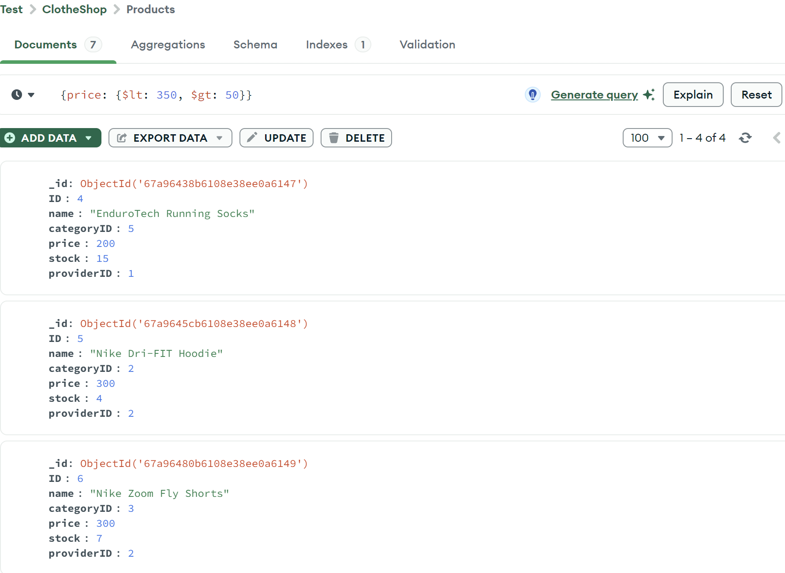

It can update a document.

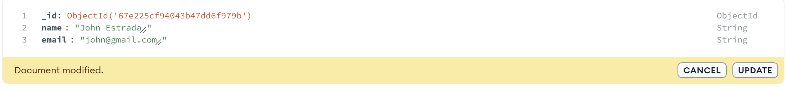

It can delete documents too.

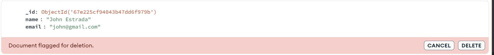

The read-write user has what the read user doesn't have, but lacks the oportunities of an admin user.

***

Return to the [README file](README.md).


