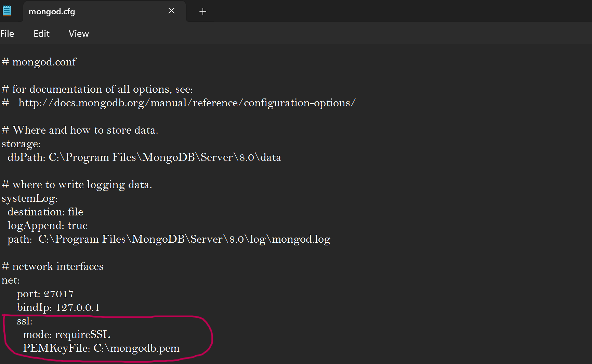

# SSL Configuration in MongoDB
In this section you will find steps to enable the SSL encryption protocol, this for a secure comunication between the MongoDB server and the host.

This protocol encryption can be set in multiple operating systems, although in Windows it can be difficult to implement, and in some cases not posible. The last part was my personal case.

Here's a small documentation that shows the steps made until the encounter of an error.


## Openssl Installation & Key and Cerficate request.
Openssl is a free software that provides secure communication between machines or server-host.

You can download Openssl here: [Openssl Download](https://slproweb.com/products/Win32OpenSSL.html?form=MG0AV3).

Install the SSL version properly and enshure that openssl is recognized in the system.

In powershell (as an administrator) this command was executed: 

```bash
openssl req -newkey rsa:2048 -new -x509 -days 365 -nodes -out C:\mongodb-cert.pem -keyout C:\mongodb-key.pem
```


This request will ask for some data, like the country, state, name server, email, and more. This fields can be filled or leaved empty, then it will create the ssl key and certificate in the **C:** directory of the computer.   
In the server name the IP 127.0.0.1 was used.


## Combine Key and Cerfificate in a Single File
To combine both the ssl key and certificate you can use the following command in the command prompt (recommended as an administrator):

```bash
type C:\mongodb-key.pem C:\mongodb-cert.pem > C:\mongodb.pem
```

The created file can now be used in the mongod.cfg file.


## Modify the Mongod.cfg file
The mongod.cfg file was opened in notepad as an administrator an the following text was added in the **net** section:

```bash
ssl:
   mode: requireSSL
   PEMKeyFile: C:\mongodb.pem
```

This added text allows the ssl protocol to be enabled in MongoDB and use the recently created ssl file.



Remember to save the changes.


## Restart MongoDB
To apply the changes made to the mongod.cfg file, it necessary to restart the MongoDB service. This can be made using the following commands in command prompt (recommended as an administrator):

To stop MongoDB:

```bash
net stop MongoDB
```

To start MongoDB:

```bash
net start MongoDB
```

This steps where made, but the MongoDB service wouldn't start.


By exhausting research, it can be said that this error is generated because of the Windows system.  
It is possible that there is a way to make this work, but personally, i couldn't find it.  
The TLS protocol was used too, but it had the same outcome, MongoDB service wouldn't start.

Because of this error, the ssl protocol was then disabled/removed from the mongod.cfg file and the MongoDB service was restarted.
***

Return to the [README file](README.md).
